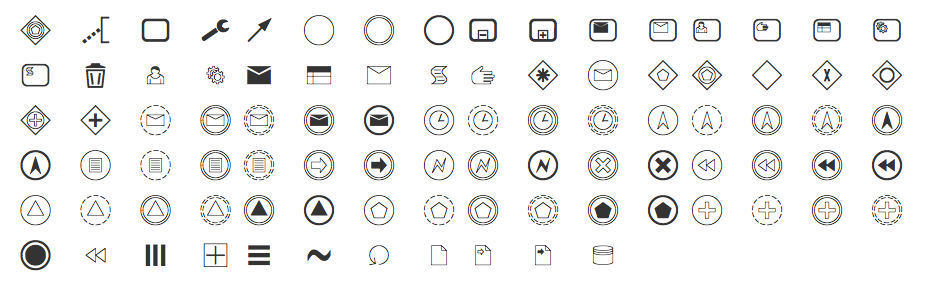

# bpmn font

A BPMN 2.0 icon font. Use it to model BPMN diagrams in your Word, VIM or other text editor.




Checkout the [demo page](https://rawgit.com/bpmn-io/bpmn-font/master/dist/demo.html) for a list of included icons and their character code.


## Usage in HTML

Include [CSS file](https://github.com/bpmn-io/bpmn-font/blob/master/dist/css/bpmn.css) and [fonts](https://github.com/bpmn-io/bpmn-font/tree/master/dist/font) into your webpage.

Use icons prefixed with `bpmn-icon-`, i.e.:

```
<span class="bpmn-icon-task"></span>
```


## License

[SIL](http://scripts.sil.org/cms/scripts/page.php?item_id=OFL_web)
